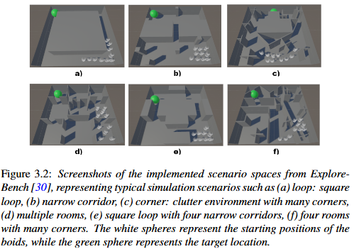

# SAR-Boids

This is the implementation used for the thesis *3DBoids in Safety-critical Urban Search and Rescue Scenario Represented by Artificial Potential Fields* re-implementing the SAR boids from the work done by Hengstebeck C. et al. (https://doi.org/10.1016/j.fraope.2024.100160). This thesis adds High-Level Planners (HLPs) in the form of Artificial Potential Fields (APFs).

## Build Requirements

- Windows (Can be changed by modifying the osqp_wrapper.c file)
- [Unity](https://unity.com/)
- [OSQP](https://github.com/osqp)
- [MSYS2 MinGW64](https://www.msys2.org/)

### Build

1. Clone the [OSQP](https://github.com/osqp) repository.
2. Make sure that there is a osqp.dll file in the Assets/Plugins folder and make sure it is up to date.
3. Open the MSYS2 MinGW64 terminal in the osqp folder and run the following commands:
    - `mkdir build`
    - `cd build`
    - `cmake -G “MinGW MakeFiles” ..`
    - `mingw32-make`
4. Build the dll wrapper file by running the following command in a MSYS2 MinGW64 terminal in the Assets/Plugins folder:
    - `gcc -shared -o osqp_wrapper.dll osqp_wrapper.c -I../osqp/include/public -I../osqp/build_api/include/public ../osqp/build_api/out/libosqpstatic.a`
5. Open Unity and play the scene.

## Modifying the Simulation

### Parameters

The easiest way to modify the behavior of the simulation is by changing the parameters used in the simulation. This can be done my opening the boidSettings.cs file (located in `Assets\Scripts\boidSettings.cs`) in the Unity UI. Most of the parameters can be changed without any constraints, but there are certain parameters that are more sensitive and could cause some issues in the current version of the implementation. These parameters are listed below and the recommended steps to change them:

- The `Grid Size` parameter should match the distance between the planes that define the space in which the boids are allowed to exist, but they also need to divisible by the `Cell Radius` * 2.
- It's important that the `Start Position` is inside of the grid to make sure that the boids are able to spawn in and not cause issues.
- The `Separation Ratio` parameter defines how close the aids to navigation (ATONs) spawn to each other. For performance this number is kept higher, since it leads to a larger number of calculations as the ratio is reduced. TLDR: ATONs are the boids which spawn around obstacles and on the planes to guide the boids, but their speed and direction are always 0.
- The `TargetLocation` game object, which can be found in the hierarchy of the scene, can be moved around in the scene to modify the end position which the boids want to make it to in order to complete the mission.
- The `Leaders` parameter of the boid settings should not exceed the `Num Boids`. This parameter controls how many of the boids are informed and use the target-seeking behavior.

To toggle between the different boids versions, change the values of `isCBF`, `PotentialField`, and `isMAPF`. The `isPath` setting is necessary for the modified APF to work correctly.

### Creating New Scenarios

Creating new scenarios is quite simple. All you need to do is to create a new scene and copy over the `BoundingBox`, `Simulation`, and `TargetLocation` game objects from the MainScene to your new scene. You can then add new obstacles to the scene by creating a 3D object (I have not tried round objects, so there could be issues with those) and changing the **Layer** of the new game object to `Obstacle`. The obstacles then need to be added to `Simulation` game object.

In addition, starting positions for the alive boids are needed, and these can be copied and pasted over from existing scenes. Simply take the `Start Positions` game object from one of the scenes and copy it to the new scene. Then change the transfrom for the individual game objects to set the starting positions. It's also important to add the `StartPositions` to the simulation, so that it can find it.

## Running the Simulation

To run the simulation on one of the scenarios, simply press play in Unity after opening the scenario. To run all scenarios with the specified metrics in SimulationRunner.cs script, open the `Launcher Scene` and press play. This will run the different versions of the scenarios until all are complete.

